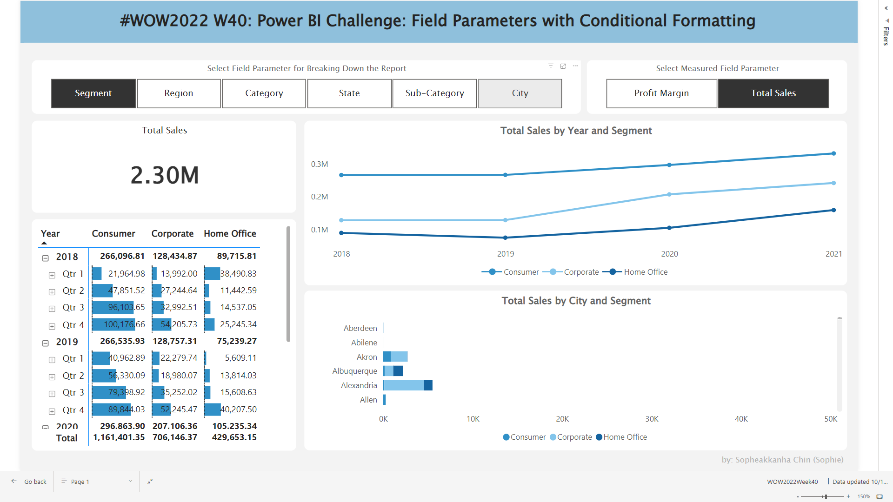

# WOW2022 Week 40 | Power BI: Field Parameters with Conditional Formatting

## Problem Statement
This Workout Wednesday Week 40 challenge involves the **Field Parameter** in Power BI which is the feature that allows users to select what fields they are using in visuals via a report slicer

The participants in this week's challenge are asked to enhance the report from [WOW2022 Week 21](https://workout-wednesday.com/pbi-2022-w21/) by introducing an additional parameter and implementing conditional formatting in the report. This improvement will add depth and interactivity to the visualization, making it more insightful and appealing to the audience.

## Challenge Requirement

- Activate the preview option, Field Parameters.
- Establish a measure named "Total Sales".
- Develop a new field parameter incorporating Total Sales and Margin %.
- Integrate the parameter field slicer into the report, enabling a single selection.
- Adapt existing visuals to utilize the newly defined parameters.
- Construct a matrix table and apply conditional formatting to each measure.

## Solution
***Dataset***: To fulfill the challenge objective, I used the dataset provided by the instruction which is the *Tableau SuperStore* dataset available on [data world](https://data.world/stanke/superstore-20214)

**Here is my visualization in Power BI after following the requirements**. ***[Click Here for Live Interactive Dashboard & Solution File](https://community.fabric.microsoft.com/t5/Data-Stories-Gallery/WOW2022-Week-40-Power-BI-Field-Parameters-with-Conditional/m-p/2832529)***

