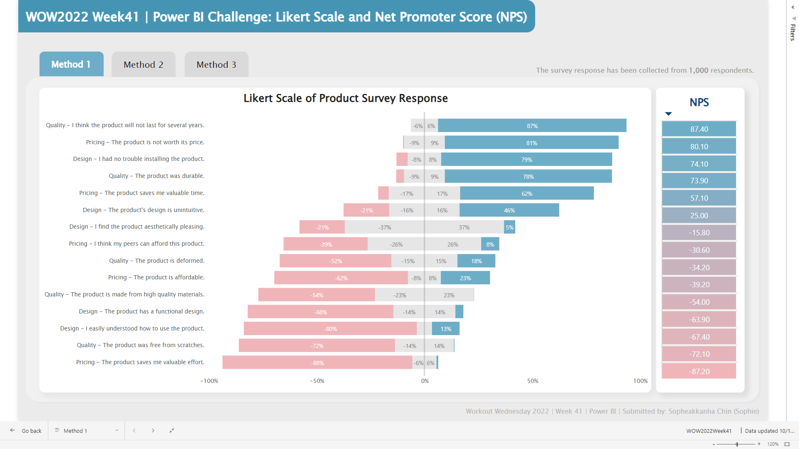

# WOW2022 Week 41 | Power BI: Likert Scale and Net Promoter Score (NPS)

## Introduction

In this week's challenge, we focus on visualizing survey data, specifically, data gathered in the form of a Likert scale. Likert scales, named after Rensis Likert, involve closed questions with a sliding scale response format.

In this exercise, we will employ a diverging bar chart to depict the distribution of responses gathered from the survey. The chart will provide an insightful visualization of the survey results.

## Solution & Process

**Dataset**: The challenge utilizes a standardized sample survey dataset accessible on [GitHub](https://github.com/MartinaGiron/TDS-code/blob/main/working-with-surveys/Random%20Survey%20Data.xlsx). This dataset serves as a common foundation for participants to work with, ensuring consistency and comparability across solutions.

**Process**: The following process is implemented in order to build a dashboard in Power BI to fulfill the challenge:
 
  **1. Data Transformation in Power Query:**
  
   - Promote headers
   - Unpivot queries
   - Create a duplicate table and assign sentiment to each query as below:
     - Remove duplicates by right-clicking
     - Assign an index to the data
     - Generate a list of negative sentiment items
     - Create a custom column as per requirements
  - Merge tables to create a new master table, including Sentiment information
  - Assign numerical values (1-5) to the query answers using a conditional column, considering the sentiment

  **2. Create a Power BI Desktop table with the following measures:**

  - Positive, Neutral, and Negative Counts. (Note: Neutral values are to be split into two to diverge across the y-axis, and Negative Count will have a negative value)
  - Create a Total value that applies to each query using the ALLEXCEPT filter to enable % calculations for each query group
  - Calculate % Scores for Positive, Neutral, and Negative Values using the DIVIDE function
  - Formulate an NPS Score as (100 * [Positive Score] + [Negative Score])
  - Create a Rank Calculation to order the bar chart and NPS by the NPS score

  **3. Visualize in Power BI: [Click Here for Live Interactive Dashboard](https://app.powerbi.com/view?r=eyJrIjoiNGQ2M2Y0OGYtNTM1ZS00YzFjLTlmY2MtMTBiOTMyYjNjMWI5IiwidCI6ImEwMjlmZWQwLWZjNGUtNDczNy1hYjA4LWNjYThiZTU3YmVkOSIsImMiOjEwfQ%3D%3D)**

