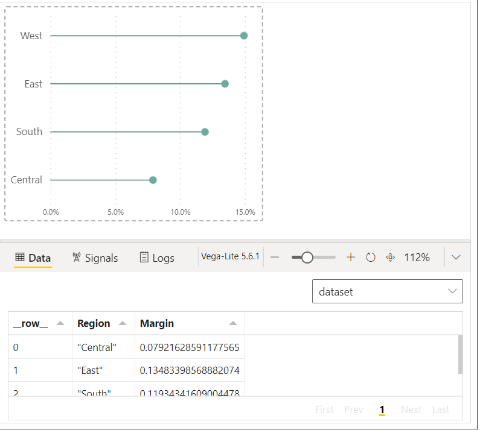

# WOW2022 Week 42 | Power BI: Deneb Custom Visuals

## Overview

This Week 42 challenge is continued from the [Week 37](https://workout-wednesday.com/pbi-2022-w37/) challenge.


In this task, we will be generating the following custom visualization by using **Deneb**:

- Chart 4: A vertical bar chart
- Chart 5: A vertical bar chart featuring labels
- Chart 6: A horizontal lollipop chart
- Chart 7: An overlapping bar chart

**Deneb** represents a specialized visualization feature within Power BI Desktop that uses, enabling users to create customized charts through the implementation of [Vega-Lite](https://vega.github.io/vega-lite/) coding. This capability allows users to produce bespoke visualizations, tailored to their specific needs and requirements. To delve into the finer details of the language and its functionalities, [CLICK HERE](https://vega.github.io/vega-lite/docs/), which serves as a valuable resource to initiate your exploration.

## Solution

**Dataset** can be found [HERE](https://data.world/stanke/superstore-20214)

Following the instruction, 4 Deneb Charts will be created

**1. Chart 4: A Vertical Bar Chart**

In order to create this chart, I wrote the following Vega-Lite code in the Deneb to customize the chart

```
{
  "data": {"name": "dataset"},
  "mark":
    {
      "type":"bar",
      "color":"#6caca0"
    },
  "encoding":{
    "y":{
      "field":"Margin",
      "type": "quantitative",
      "axis": {
        "title": null,
        "format": ".1%",
        "labelFontSize": 9
      }
    },
    "x":{
      "field": "Region",
      "type":"nominal",
      "axis":{
        "title": null,
        "labelAngle":0
      }
    }
  }
}
```
By writing this above Vega-Lite coding, we got a visualization as below:


**2. Chart 5: A Vertical Bar Chart Featuring Labels**

I customized this chart by the code below:

```
{
  "data": {"name": "dataset"},
  "encoding":{
    "y":{
      "field":"Margin",
      "type": "quantitative",
      "axis": null
    },
    "x":{
      "field": "Region",
      "type":"nominal",
      "axis":{
        "title": null,
        "labelAngle":0
      }
    }
  },
  "layer":[
    {
      "mark": 
        {
          "type":"bar",
          "color":"#85bab0"
        }
      
    },
    {
      "mark":{
        "type":"text",
        "dy": -10
      },
      "encoding":{
        "text":{
          "field": "Margin",
          "format": ".1%"
        }
      }
    }
  ]
}
```
And this is how the visual looks like


**3. Chart 6: A Horizontal Lollipop Chart**

The horizontal lollipop chart is customized by below Vega-Lite

```
{
  "data": {"name": "dataset"},
  "layer":
  [
    {
      "mark": {
        "type": "rule",
        "strokeWidth": 1,
        "color": "#42746b"
      }
    },
    {
      "mark": {
        "type": "circle",
        "size": 80,
        "opacity": 1,
        "color": "#6caca0"
      }
    }
  ],
  "encoding": {
    "x": {
      "field": "Margin",
      "type": "quantitative",
      "axis": {
        "title": null,
        "format": ".1%",
        "labelFontSize": 9
      }
    },
    "y": {
      "field": "Region",
      "type": "nominal",
      "sort": "-x",
      "axis": {"title": null}
    }
  }
}
```



**3. Chart 7: An Overlapping Bar Chart**

I customize this Deneb in order to build overlapping bar chart

```
{
  "data": {"name": "dataset"},
  "layer":
  [
    {
      "mark": {
        "type": "rule",
        "strokeWidth": 15,
        "color": "#d0e5e1"
      },
      "encoding": {
        "x": {
        "datum": ".2",
        "type": "quantitative",
        "axis": {
          "title": null,
          "format": ".1%",
          "labelFontSize": 9
          }
        }
      }
    },
    {
      "mark": {
        "type": "rule",
        "strokeWidth": 5,
        "color": "#6caca0"
      },
      "encoding": {
        "x": {
        "field": "Margin",
        "type": "quantitative",
        "axis": {
          "title": null,
          "format": ".1%",
          "labelFontSize": 9
          }
        }
      }
    }
  ],
  "encoding": {
    "y": {
      "field": "Region",
      "type": "nominal",
      "sort": {
        "field": "Margin",
        "order": "descending"
      },
      "axis": {"title": null}
    }
  }
}
```


##Final Visualization

Therefore, here is the final visualization ([CLICK HERE](https://app.powerbi.com/view?r=eyJrIjoiYmY1ZjdjNTMtOWI1MC00NmMyLTlmOTctNTMzNzY3Y2NhYTNiIiwidCI6ImEwMjlmZWQwLWZjNGUtNDczNy1hYjA4LWNjYThiZTU3YmVkOSIsImMiOjEwfQ%3D%3D) to the Interactive Dashboard in Power BI)


