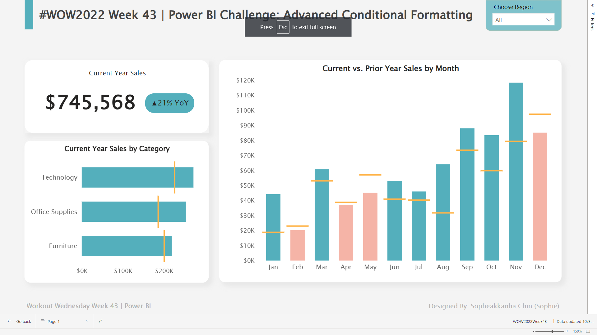

# WOW2022 Week 43 | Power BI: Advanced Formatting by Jeremy Anderson

## Introduction

Conditional formatting in Power BI is a powerful tool that allows you to enhance user insights effectively. Typically, it is used on table and matrix visuals, where you can apply various formatting styles like background colors, font colors, or icons based on specific rules.

However, Power BI's conditional formatting capabilities extend beyond tables. Surprisingly, you can even apply conditional formatting to shape colors!

During this week, we plan to integrate conditional formatting throughout our report. We will use it to apply conditional color formatting to visual backgrounds, borders, and bars. This dynamic approach ensures that colors change dynamically based on the regions and bars selected on the charts, as illustrated in the example below.

## Requirement

- Change the default visual interaction from cross highlighting to cross filtering by navigating to "Options and settings" > "Options" > "CURRENT FILE" > "Report Settings."
- Consider using or creating a dedicated calendar table with columns like Date, Year, Month Name, Current Year (True/False), Prior Year (True/False), and Month Number after importing the data.
- Connect the calendar table to the orders table using a many-to-one relationship based on the date field.
- Create the following measures:
  - Sum of Current Year Sales
  - Sum of Prior Year Sales
  - Year-Over-Year (YOY) Percent Change
- Define a measure that assigns specific colors to indicate positive and negative YOY sales using hex codes: #689CCA (blue) and #F59C4E (orange).
- Create four visuals:
  - Current Year Sales
  - YOY Sales Indicator
  - Current Year Sales by Category (using the Bullet Chart by OKVIZ)
  - Current vs. Prior Year Sales by Month (using the Bullet Chart by OKVIZ)
- Apply conditional formatting to the YOY Sales Indicator, Sales by Category, and Sales by Month visuals.
- Add a filter for the region to enable region-specific data analysis.
- Enhance visual representation by adding a custom legend using text boxes and shapes for improved clarity and presentation.
  
**Dataset**: [Available Here](https://data.world/nerdywithdata/sample-superstore)

## Visualization

Check out the interactive dashboard in [Power BI](https://app.powerbi.com/view?r=eyJrIjoiMzRlZjM5NjYtOTY1Ni00NGZkLWFjNDgtNmZkY2E1NDg4MGNjIiwidCI6ImEwMjlmZWQwLWZjNGUtNDczNy1hYjA4LWNjYThiZTU3YmVkOSIsImMiOjEwfQ%3D%3D)

