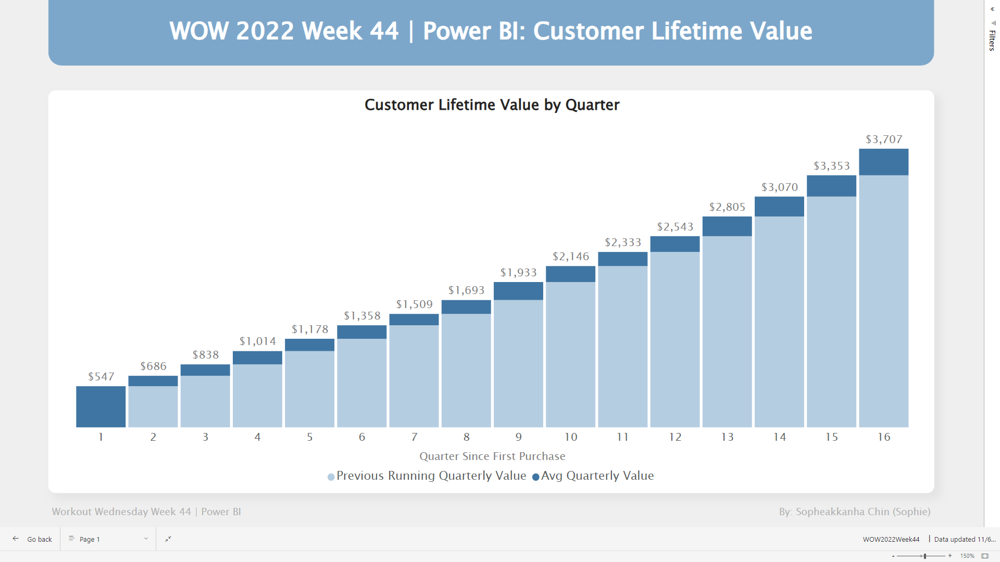

# WOW2022 Week 44 | Power BI: Customer Lifetime Value

## Overview

This week's task involves a challenging assignment: calculating customer lifetime value by quarter using DAX. This particular challenge is of an advanced nature, so we should be prepared to tackle it with determination and expertise. Let's approach it with a focused mindset and dedication to excel.

## Requirement

Create a stacked bar chart that displays the cumulative value of consumers for each quarter since their initial order.

The total bar size will represent the running total of customers per quarter. Additionally, the first bar will represent the incremental value by quarter, highlighted in the color #5557EB. On the other hand, the second bar will represent the value from previous quarters, which is the difference between the total value and the incremental value for the current quarter, displayed in the color #BCBCF7

**Dataset**: [Click Here](https://data.world/nerdywithdata/sample-superstore/workspace/file?filename=Sample+-+Superstore.xls)

## Solutions

- Determine the "First Order Date" for each row based on the Customer ID.
- Calculate the "Max Quarters as Customer" by finding the maximum number of months a customer could have been active, considering the time difference between the first order date (of the customer) and the last order date (across all orders).
- Calculate "Quarters Since First Purchase" for each row based on the Customer ID and Order Date.
- Calculate "Customer Count by Quarter Since First Order" to find the total count of customers eligible to have sales for each quarter.
- Compute the "Average Quarterly Value by Customer" to get the average value for each customer per quarter.
- Use the "Avg Quarterly Value by Customer (SUMX)" formula, wrapped in SUMX over VALUES of calculation 3, to address any aggregation issues.
- Calculate the "Running Total of Avg Quarterly Value" by utilizing the results from calculation 6.
- Compute the "Running of Quarterly Value for Previous Quarter" by subtracting calculation 7 from calculation 5.

## Visualization in Power BI

*Here is the complete visualization in [Power BI](https://app.powerbi.com/view?r=eyJrIjoiZWFhZmNkYzMtZjgwZS00YzU5LWFhMWUtM2JiZTRhNzhhZWYxIiwidCI6ImEwMjlmZWQwLWZjNGUtNDczNy1hYjA4LWNjYThiZTU3YmVkOSIsImMiOjEwfQ%3D%3D)*

